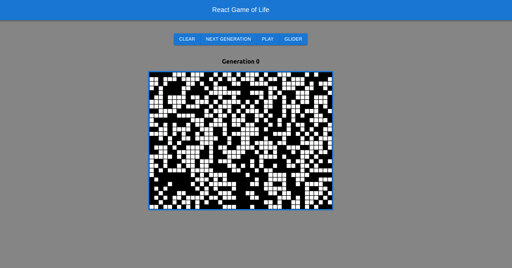

# React Game of Life

An implementation of [Conway's Game of Life](https://en.wikipedia.org/wiki/Conway%27s_Game_of_Life) in React



Try it out [here](https://react-game-of-life-xi.vercel.app/)

## Prerequisites

1. [Node.js](https://nodejs.org/en/)
2. [Docker](https://docs.docker.com/install/) (optional)
3. [Docker-compose](https://docs.docker.com/compose/install/) (optional)

## Install dependencies

```bash
$ npm ci
```

## Available Scripts for development

Runs the app in the development mode. Open http://localhost:3000 to view it in the browser.

```bash
$ npm run dev
```

Clear out any stuck node processes.

```bash
$ npm run clean
```

## Available Scripts for production

Generates an optimized version of the application for production.

```bash
$ npm run build
```

To run in production mode

```bash
$ npm run start
```

## Docker command for production (Optional)

```bash
$ docker-compose up --build
```
