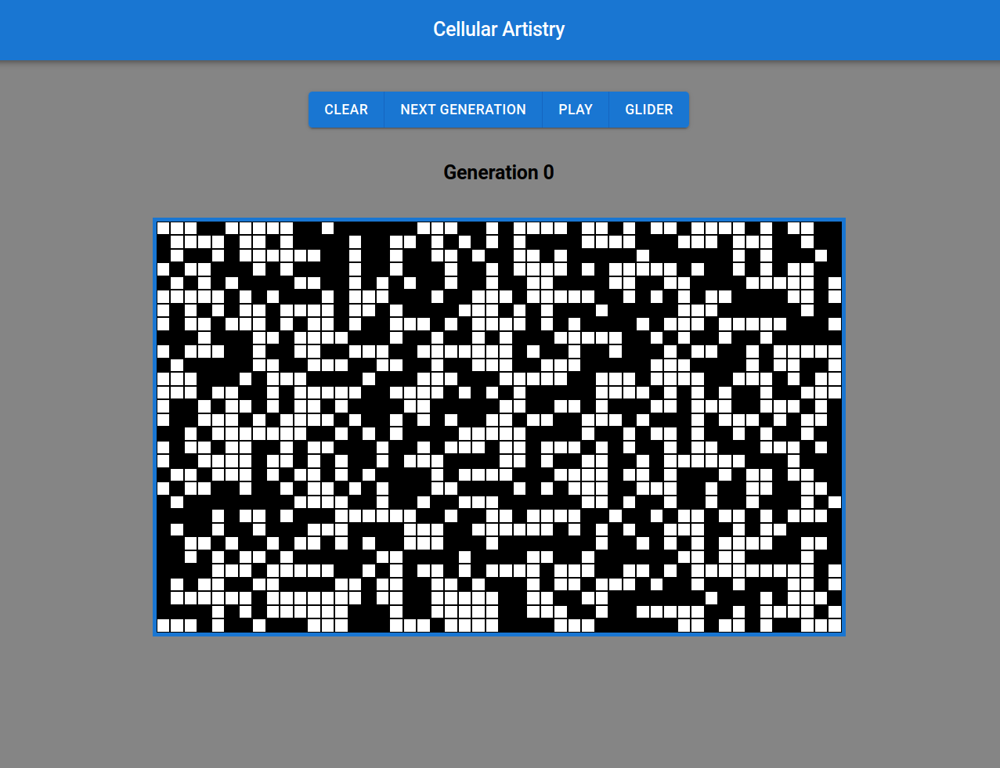

# Cellular Artistry

A web-based implementation of [Conway's Game of Life](https://en.wikipedia.org/wiki/Conway%27s_Game_of_Life).



You can try it out right now by clicking [here](https://pacna.github.io/cellular-artistry/).

## Prerequisites

Before you begin using Cellular Artistry, make sure you have the following dependencies installed on your system:

1. [Node.js](https://nodejs.org/en)
2. [Make](https://www.gnu.org/software/make/)

## Running locally

To run Cellular Artistry on your local machine, execute the following command:

```bash
$ make local
```

After running the command, open your web browser and navigate to http://localhost:3000 to explore Cellular Artistry locally.

## Running tests

To execute the tests, use the following command:

```bash
$ make test
```
